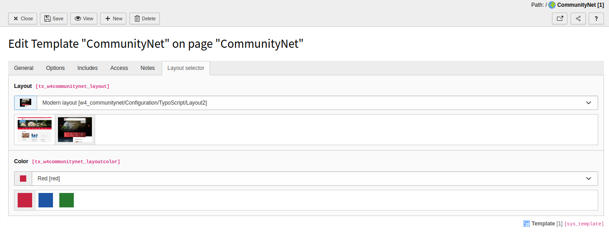
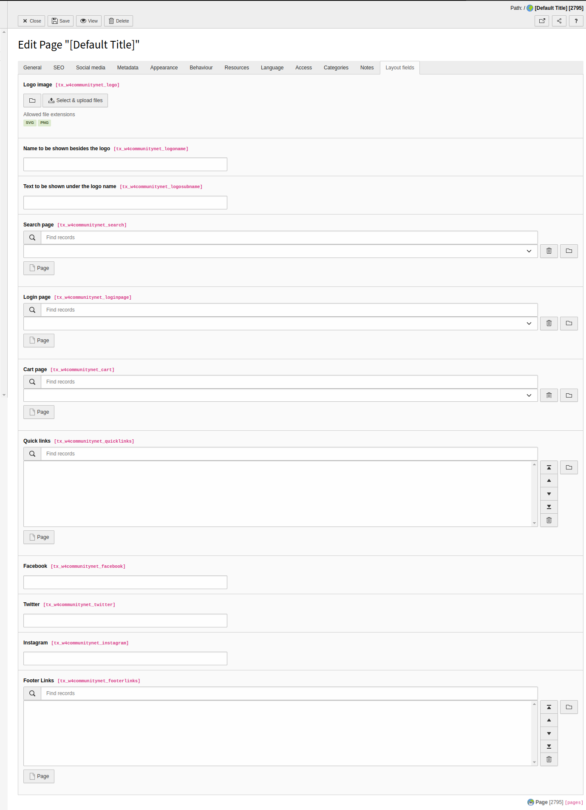
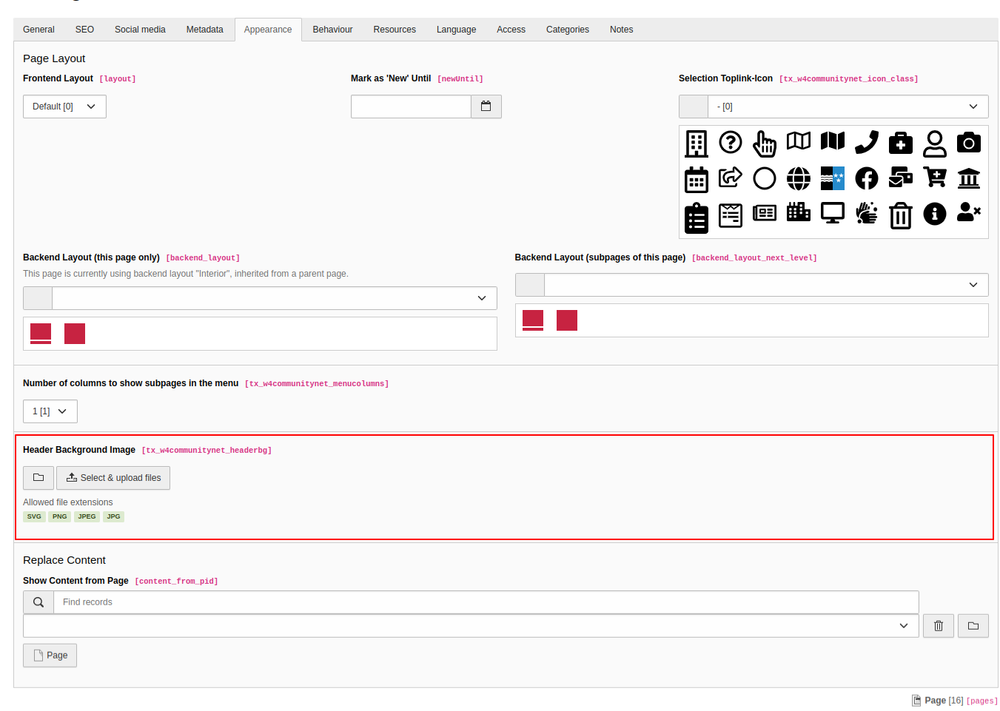
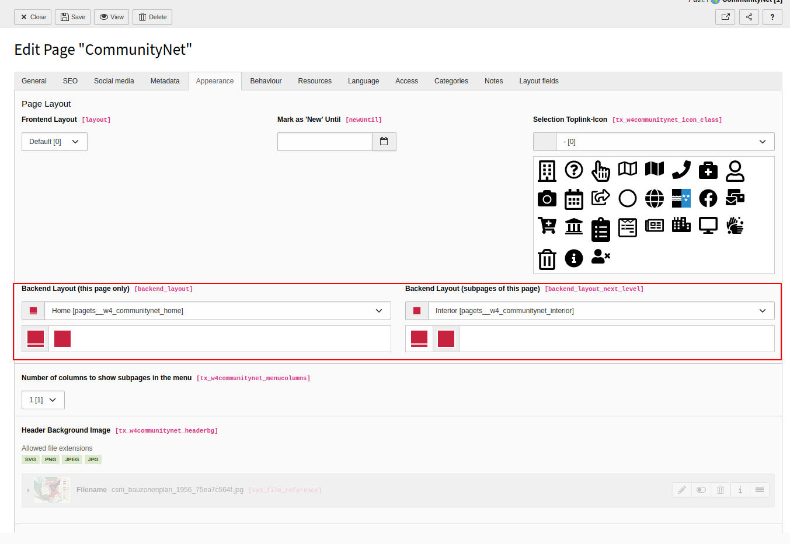

.. include:: /Includes.rst.txt
.. index:: Configuration
.. _configuration-general:

=====================
General configuration
=====================

 

.. contents::
     :local:
     :depth: 1

 

Layout selector
================

The community net extension comes with two frontend themes a basic layout and mordern layout. 
To choose the theme,  goto module :guilabel:`Web > Template` and choose your root page. It should
already contain a TypoScript template record if not create a new TypoScript template record. Switch to view
:guilabel:`Info/Modify` and click on :guilabel:`Edit the whole template record`.

Switch to tab :guilabel:`Layout selector` and choose a layout and a color for
the selected layout from the list and save  

Header and footer Configurations
================================

The community net extension theme have configurable header and footer section. To configure the header and footer 
goto module :guilabel:`Web > Page` and choose your root page and edit root page. 

Header Background Image
=======================
To change the header background goto :guilabel:`Web > Page` and choose your page and edit the page. Switch to the tab :guilabel:`Appearance` and select already uploaded image or upload new image.

Backend Layout
================================

To configure the backend layout, go to module :guilabel:`Web > Page` and choose the page and edit the page

Select backend layout for current page and select the backend layour for subpages. if no backend layout is selected then the layout specified in the parent page will be rendered in the backend.