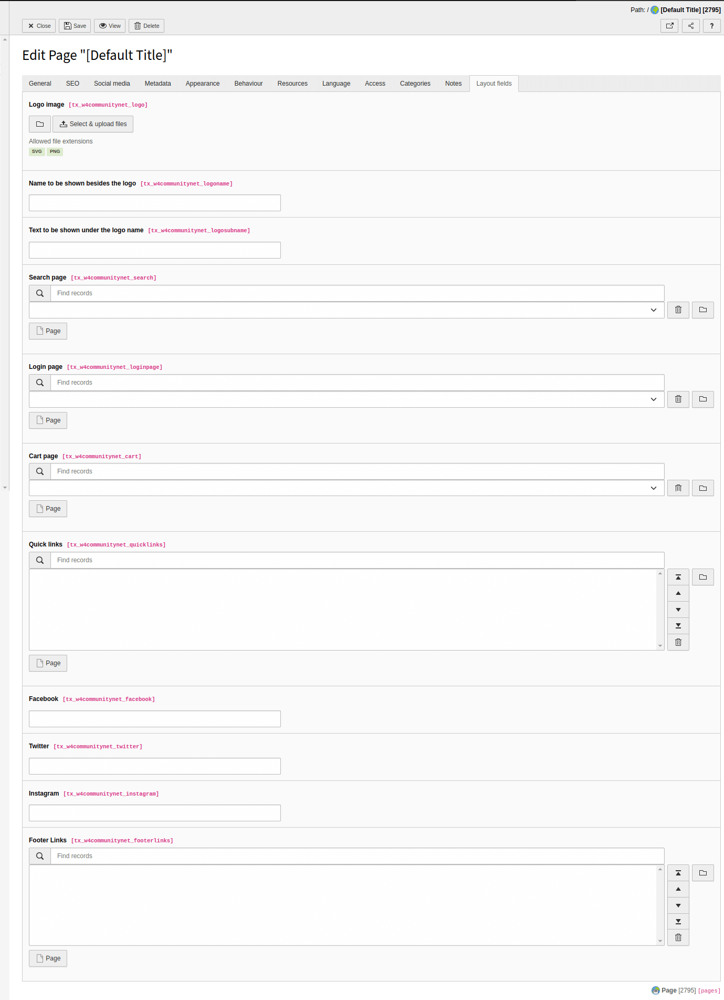

.. include:: /Includes.rst.txt
.. index:: Configuration
.. _configuration-general:

=====================
General configuration
=====================

 

.. contents::
     :local:
     :depth: 1

 

Layout selector
================

A basic layout theme is included with the community net extension, and  custom themes can also be added by extending it. 
To choose the theme, go to the module :guilabel:`Web > Template` and choose your root page. It should
already contain a TypoScript template record if not create a new TypoScript template record. Switch to 
View :guilabel:`Info/Modify` and click on :guilabel:`Edit the whole template record`.

.. figure:: ../Images/LayoutSelector.png
   :width: 820px
   :class: with-shadow

Switch to tab :guilabel:`Layout selector` and choose a layout and a color for
the selected layout from the list and save  

Header and footer Configurations
================================

The community net extension theme has a configurable header and footer section. To configure the header and footer 
goto module :guilabel:`Web > Page` and choose your root page and edit the root page. 

Header Background Image
=======================

To change the header background go to :guilabel:`Web > Page` 
choose your page and edit the page. Switch to the tab :guilabel:`Appearance` 
and select the already uploaded image or upload a new image.

Backend Layout
================================

To configure the backend layout, go to the module :guilabel:`Web > Page` and choose the page and edit the page

Select the backend layout for the current page and select the backend layout for subpages. if no backend layout is selected then the layout specified in the parent page will be rendered in the backend. 