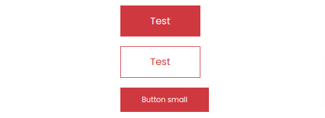

.. include:: /Includes.rst.txt
.. index:: Editors

.. _configurationButton:
 
======================
Button Content Element
======================

      
The button content element provides the possibility to render a button with a configurable link, text, layout, size, and text alignment.
Follow these steps to add a counter content element to a page:

 
#. Go to module :guilabel:`Web > Page` and to the page where you want to add the button content

#. Add a new content element and select the entry
   :guilabel:`CommunityNet > Buttons`.

   .. image:: ../Images/ButtonContentElement_step_1.png
      :class: with-border with-shadow

#. Switch to the tab :guilabel:`Configuration` where you can define the content settings. 

   #. Fill out all desired fields and click :guilabel:`Save`.

   #. Save the plugin.

   .. image:: ../Images/ButtonContentElement_step_2.png
      :class: with-border with-shadow