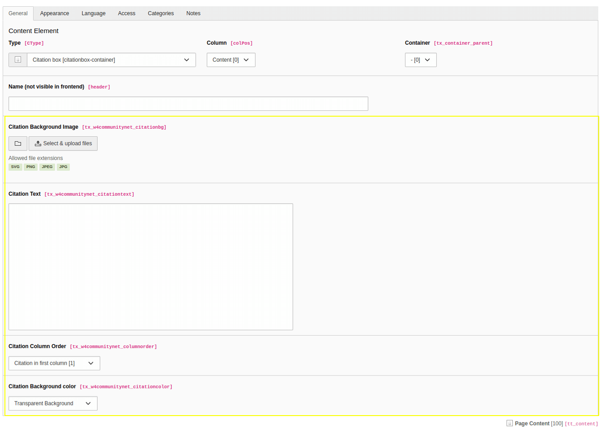

.. include:: /Includes.rst.txt
.. index:: Editors

.. _configurationCitationBox:
 
============================
Citation Box Content Element
============================

The Citation Box content element provides the possibility to set citation text in one column and content in another column. In big viewports (desktop) there are displayed side-by-side columns, the columns stack as the viewport gets smaller (mobile).
Follow these steps to add a counter content element to a page:

#. Go to module :guilabel:`Web > Page` and to the page where you want to add the citation box content

#. Add a new content element and select the entry
   :guilabel:`Container > Citation box`. This will create a new container on the page

#.  Add content to the citation box container by clicking on the :guilabel:`+ content` button. if no content is added then the content column will not be displayed on the frontend.

#. In order to add citation text to the citation box edit the content element.

#. Switch to the tab :guilabel:`CommunityNet` where you can define the content settings. 

   #. Fill the field :guilabel:`Citation Background Image`.	
   #. Fill the field :guilabel:`Citation Text`. If no text is filled then the citation column will not be displayed in the frontend and the content column take up full width.
   #. in the field :guilabel:`Citation Column Order` user can configure the order of the citation box to be displayed.
   #. in the field :guilabel:`Citation Background color` user can configure the background color of the citation box container.

   #. Save the content element.

Backed view

Frontend view