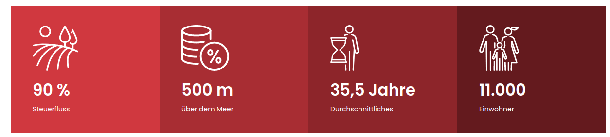
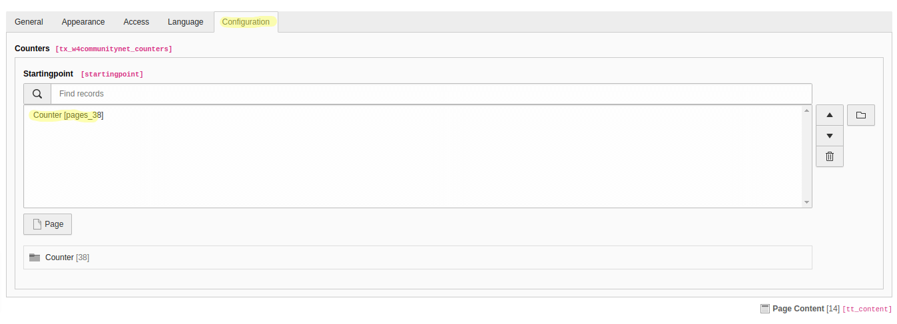

.. include:: /Includes.rst.txt
.. index:: Editors

.. _configurationCounter:
 
=========================
Counters Content Element
=========================

The counter content element provides the possibility to set multiple animated counters in a row. In big viewports (desktop) there are 4 columns of the counter, and the columns stack as the viewport gets smaller (mobile).

Create Counter records
===================

Before any counter record can be shown in the frontend those need to be
created.

#. Go to the module :guilabel:`Web > List`

#. Go to the Folder where you wanted to create the counter record.

#. Click on the link :guilabel:`CommunityNet -> counters`.

#. Fill out all desired fields and click :guilabel:`Save`.

How to create the counter element?
--------------------------

A Counter content element is used to render a defined selection of counter records in the frontend.
Follow these steps to add a counter content element to a page:

#. Go to module :guilabel:`Web > Page` and to the page where you want to add the counter content

#. Add a new content element and select the entry
   :guilabel:`CommunityNet > Counters`.

#. Switch to the tab :guilabel:`CommunityNet` where you can define the content settings. 

   #. Fill the field :guilabel:`Startingpoint` by selecting the :guilabel:`sysfolder`.

   #. Save the plugin.

