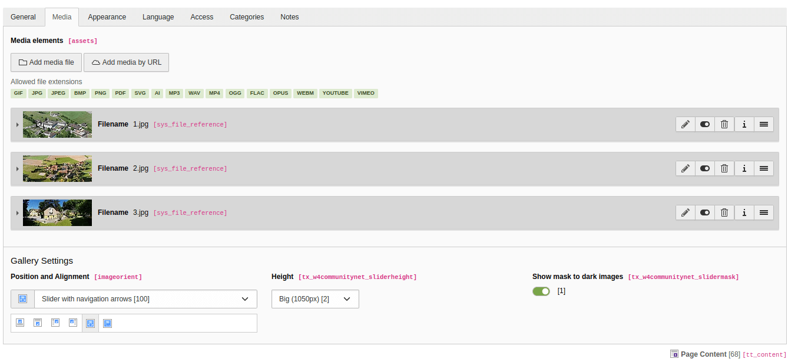

.. include:: /Includes.rst.txt
.. index:: Editors

.. _configurationSlider:
 
==================================
Slider option for the Text & media
==================================

The default typo3 content element is extended so that it can be rendered as a slider. Follow these steps to add an iframe content element to a page.

Iframe content elements render a responsive iframe with different aspect ratios.

#. Go to the module :guilabel:`Web > Page` and select the page where you want to add the Slider content element.

#. Add a new content element and select the entry 
   :guilabel:`Plugins > Text & Media [textmedia]`.

#. Switch to the tab :guilabel:`Media` where you can define the Slider Content settings. 

#. Add images to the field :guilabel:`Media elements`.

#. Select either :guilabel:`Slider with navigation arrows [100]` or  :guilabel:`Slider with navigation buttons` option in the field :guilabel:`Gallery Settings -> Position and Alignment` so that the content element is rendered as the slider.

#. Select :guilabel:`Height` field .

#. Check :guilabel:`Show mask to dark images` field if you need a black overlay to be visible on top of the slider images.

#. Click :guilabel:`Save`.

Backed view

Frontend view

