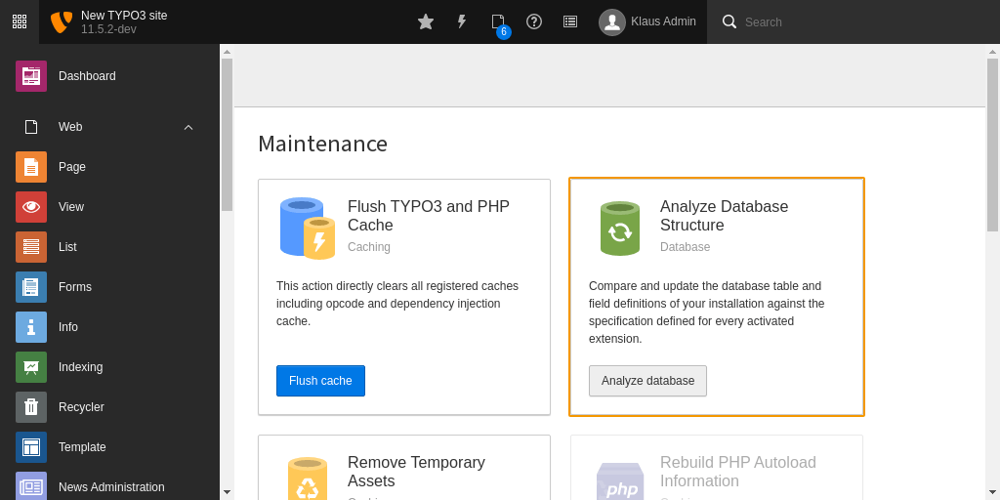

.. include:: /Includes.rst.txt

.. _installation:

============
Installation
============

Add repository path git@git.w-4.ch:w4servicesgmbh/communitynet-product/w4_communitynet.git to your application composer.json file

.. code-block:: json

    "repositories": [
        {
            "type": "vcs",
            "url": "git@git.w-4.ch:w4servicesgmbh/communitynet-product/w4_communitynet.git"
        }
    ],

then install this  via composer : 

.. code-block:: bash

   composer require w4services/w4_communitynet

in a TYPO3 v11.5+ installation.

Update the database scheme
--------------------------

Open your TYPO3 backend with :ref:`system maintainer <t3start:system-maintainer>`
permissions.

In the module menu to the left navigate to :guilabel:`Admin Tools > Maintenance`,
then click on :guilabel:`Analyze database` and create all.

Clear all caches
----------------

In the same module :guilabel:`Admin Tools > Maintenance` you can also
conveniently clear all caches by clicking the button :guilabel:`Flush cache`.

.. figure:: ../Images/FlushCache.png
   :width: 820px
   :class: with-shadow

