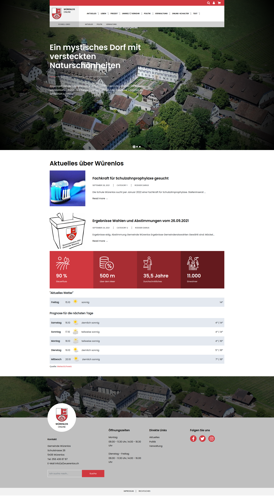
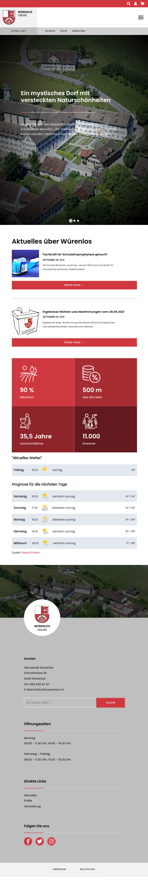
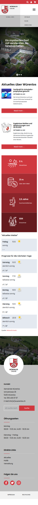

.. include:: /Includes.rst.txt

.. _introduction:

============
Introduction
============

CommunityNet extension is a theme for TYPO3 CMS based on the Bootstrap CSS Framework. CommunityNet comes with a fully configurable Frontend via backend settings and TypoScript. 

Features
========

* Multiple configurable themes
* Frontend heading and footer is fully confgurable from backend
* Content Elements
   - Button
   - Iframe
   - Counters
   - Citation box
 

Screenshots
===========

   Desktop View

   Tablet View

   Mobile View
