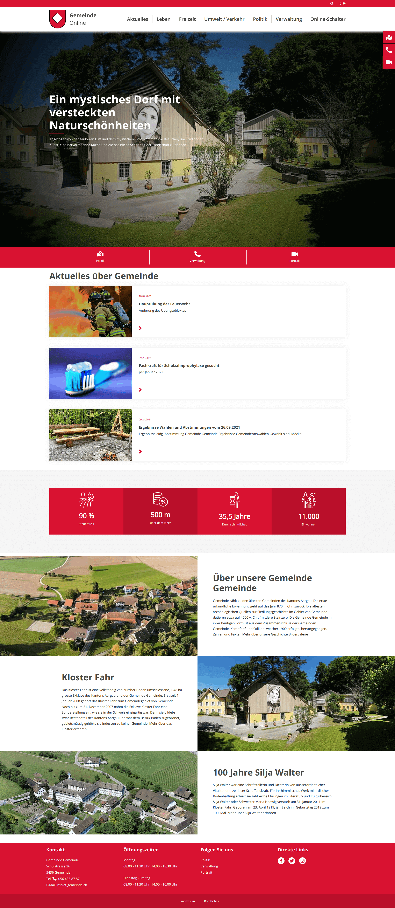
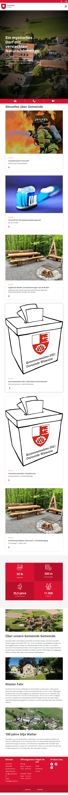
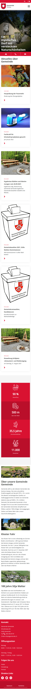

.. include:: /Includes.rst.txt

.. _introduction:

============
Introduction
============

The CommunityNet extension for TYPO3 CMS is based on the Bootstrap CSS Framework. In CommunityNet, the Frontend can be totally customized via the backend settings and TypoScript.

Features
========

* The frontend heading and footer are fully configurable from the backend
* Content Elements
   - Button
   - Iframe
   - Counters
   - Citation box
 

Screenshots
===========

   Desktop View

   Tablet View

   Mobile View
